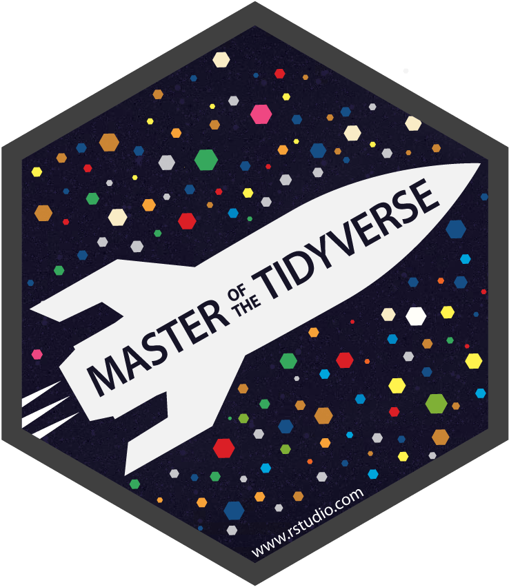

```{r metathis, echo=FALSE}
library(metathis)
meta() %>%
  meta_name("github-repo" = "beatrizmilz/resume") %>% 
  meta_social(
    title = "Beatriz Milz CV",
    description = paste(
      "CV made with the packages RMarkdown, pagedown, datadrivencv."
    ),
    url = "https://beatrizmilz.github.io/resume/index.html",
    image = "https://beatrizmilz.github.io/resume/img/share-card.png",
    image_alt = paste(
      "Beatriz Milz CV"
    ),
    og_type = "website",
    og_author = "Beatriz Milz",
    twitter_card_type = "summary_large_image",
    twitter_creator = "@beamilz"
  )
```
<!-- inicio academic icons -->
<link rel="stylesheet" href="https://cdn.jsdelivr.net/gh/jpswalsh/academicons@1/css/academicons.min.css">
<!-- final academic icons -->

 
<!-- inicio font awesome -->
<script src="https://kit.fontawesome.com/1f72d6921a.js" crossorigin="anonymous"></script>

 
<!-- final font awesome -->

```{r, include=FALSE}
knitr::opts_chunk$set(
  results='asis',
  echo = FALSE
)

library(magrittr) # For the pipe
source("cv_printing_functions.r")

# Read in all data and initialize a CV printer object
CV <- create_CV_object(
  data_location = "https://docs.google.com/spreadsheets/d/1iBxpNzwZWOrOwR__Y4FNDQ_3tpw-0trS0PVigsS4z6w/edit?usp=sharing",  
  pdf_mode = params$pdf_mode
)


CV$entries_data <- CV$entries_data %>% dplyr::filter(in_resume == TRUE)


```


```{r}
# When in pdf export mode the little dots are unaligned, so fix that with some conditional CSS.
if(params$pdf_mode) {
    cat("
<style>
:root{
  --decorator-outer-offset-left: -6.5px;
}
</style>")
}
```


Aside
================================================================================


```{r}
if(params$pdf_mode){
  cat("View this CV online with links at https://beatrizmilz.github.io/resume/")
} else {
  cat("<i class='fas fa-download'></i> [Download this resume in PDF](https://beatrizmilz.github.io/resume/index.pdf).")
}
```


Software {#software}
--------------------------------------------------------------------------------

<i class="fas fa-box-open"></i> [Package {dados}](https://cienciadedatos.github.io/dados/) - Co-Author. 


Programming Skills {#skills}
--------------------------------------------------------------------------------

<i class="fab fa-r-project"></i> `R`

```{r echo=FALSE, out.width="5%"}
#
```
<i class="fa fa-area-chart" aria-hidden="true"></i>
 `tidyverse`

<i class="fas fa-code-branch"></i> `Git`

<i class="fab fa-github"></i> `GitHub`

<i class="fab fa-markdown"></i> `Markdown`

<i class="fab fa-html5"></i> `HTML`

<i class="fab fa-css3-alt"></i> `CSS`


Disclaimer {#disclaimer}
--------------------------------------------------------------------------------

This resume was made with the R package [**pagedown**](https://github.com/rstudio/pagedown) and [**datadrivencv**](http://nickstrayer.me/datadrivencv/index.html).

Code available on <i class="fa fa-github"></i>  [GitHub](https://github.com/beatrizmilz/resume). 

Last updated on `r Sys.Date()`. The most recent version of this resume is [available here](https://beatrizmilz.github.io/resume/index.pdf). 


Main
================================================================================

Beatriz Milz {#title}
--------------------------------------------------------------------------------

__English__: Hello! My name is Beatriz, and I'm a Doctorate Student in Environmental Sciences. <!-- , and I'm an enthusiast of the  R programming language, of open source and reproducible research. --> __Português__: Olá! Meu nome é Beatriz, e sou doutoranda em Ciência Ambiental. <!-- Sou entusiasta da linguagem de progração R, de software livre e de pesquisa reprodutível. --> __Español__: ¡Hola! Mi nombre es Beatriz, soy estudiante de doctorado en Ciencias Ambientales. <!-- Soy entusiasta del lenguaje R, de software libre y de investigación reproducible. -->

Education {data-icon=graduation-cap data-concise=true}
--------------------------------------------------------------------------------

```{r}
CV %<>% print_section('education')
```


Research Projects {data-icon=laptop}
--------------------------------------------------------------------------------

```{r}
CV %<>% print_section('research_projects')
```

Teaching Experience {data-icon=chalkboard-teacher}
--------------------------------------------------------------------------------

```{r}
CV %<>% print_section('teaching_experience')
```


Scientific Journals {data-icon=book }
--------------------------------------------------------------------------------

```{r}
CV %<>% print_section('scientific_journals')
```

Projects {data-icon=share-alt}
--------------------------------------------------------------------------------

::: aside

I'm an active participant in the local R community: I'm a co-organizer of R-Ladies São Paulo, and I have taught in several meetups and workshops, 
in the chapters São Paulo, Niterói, Curitiba and Goiânia.


I'm a co-organizer of SatRdays São Paulo, and a certified Carpentries Instructor. 

### Languages

**Portuguese:** Native

**English:** Proficient

**Spanish:** Beginner

### GRANTS

- <i class="far fa-star"></i> [LatinR 2019](https://latin-r.com/) - Travel and Conference.

- <i class="far fa-star"></i> [useR! 2019](https://user2019.r-project.org/). Diversity Scholarship - Travel and Conference.

- <i class="far fa-star"></i> [FAPESP Doctorate Scholarship](https://bv.fapesp.br/en/bolsas/185176/active-transparency-in-the-management-of-water-resources-in-the-sao-paulo-macrometropolis-using-the/)


### CONTACT

- <i class="fa fa-envelope"></i> beatriz.milz@usp.br

- <i class="fa fa-twitter"></i> [Twitter: `@`BeaMilz](https://twitter.com/BeaMilz)

- <i class="fa fa-github"></i> [GitHub: `@`beatrizmilz](https://github.com/beatrizmilz)

- <i class="fa fa-external-link-alt"></i> <a href='http://lattes.cnpq.br/5150665880581477'> Lattes </a> 

- <i class="fab fa-orcid"></i> <a href='https://orcid.org/0000-0002-3064-4486'> Orcid </a>  

- <i class="fa fa-home"></i> [beatrizmilz.com](https://beatrizmilz.com)

- <i class="fab fa-discourse"></i> [Discourse](https://discourse.curso-r.com/u/beatrizmilz/summary)

:::


```{r}
CV %<>% print_section('community_projects')
```


Selected Events organized {data-icon=calendar-check}
--------------------------------------------------------------------------------

```{r}
CV %<>% print_section('events_organized')
```


Selected Oral Communications {data-icon=chalkboard-teacher}
--------------------------------------------------------------------------------

```{r}
CV %<>% print_section('oral_communications')
```

Selected Publications from Events {data-icon=chalkboard-teacher}
--------------------------------------------------------------------------------

```{r}
CV %<>% print_section('publications_scientific_events')
```

Selected Short Courses Attended {data-icon=book} 
--------------------------------------------------------------------------------

```{r}
CV %<>% print_section('short_courses')
```


:::aside
<i class="fas fa-download"></i> [Download](https://beatrizmilz.github.io/resume/index.pdf)
:::